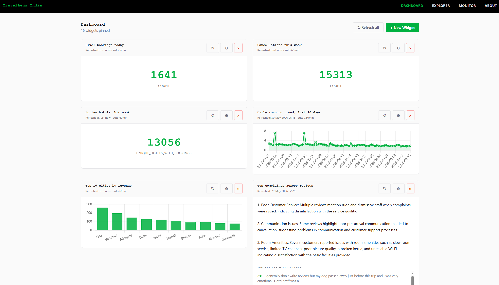

# TravelLens India


A real-time hotel and tourism intelligence platform for the Indian hospitality market — streaming pipeline, star-schema warehouse, local LLM serving layer, and a Grafana-style dashboard that turns plain-English questions into pinned, refreshable widgets.



> **Full architecture, design decisions, and trade-offs live in [`Travellense`](https://bh00t.github.io/travellens/) — the technical blueprint.** Open it in a browser for the deep dive. This README is the short front door.
>
> *Note: the blueprint is the **original** design (Flink streaming, DuckDB exploration, Claude API). The shipped build pivoted to a pure-Python Kafka consumer, dropped DuckDB, and serves a local Ollama model. Where the blueprint and the repo conflict, the repo wins.*

---

## The problem

Hospitality analytics in India still runs on overnight CSV exports and BI dashboards nobody can change without a developer. By the time the morning report lands, the window where you could have repriced an under-booked night, intercepted a churning loyalty guest, or flagged a sentiment swing has already closed. TravelLens collapses that loop: bookings stream in, results are queryable in seconds, and the people closest to the business compose their own widgets in plain English.

## Architecture at a glance

```
PMS event stream ─► Kafka ─► Python streaming consumer ─► Postgres + S3 Parquet
                                  (60-min tumbling                 (star-schema DWH
                                   windows, keyed                   + agg tables)
                                   by city, dual sink)                  │
                                                                        ▼
                              Browser ◄── Flask dashboard ◄── AI serving layer
                                          (frozen SQL +       (text-to-SQL via
                                           JSONB result        Ollama, semantic
                                           cache)              search via pgvector)
```

The principle: the read path never triggers compute. SQL is authored once by the LLM at pin time, frozen on the widget row, and re-executed against the warehouse on a schedule. Dashboard loads serve cached JSON — stale-while-revalidate, the same shape a CDN uses.

## Tech stack

| Layer       | Technology |
|-------------|------------|
| Streaming   | Kafka · Zookeeper · pure-Python event consumer · MinIO (S3) · Apache Parquet |
| Storage     | PostgreSQL 16 · pgvector |
| AI          | Ollama · Qwen2.5-Coder-7B (SQL) · sentence-transformers all-MiniLM-L6-v2 (embeddings) · IVFFlat |
| Serving     | Flask · Jinja2 · Chart.js |
| Dev / infra | Docker Compose · psql |

## Key engineering highlights

One line each — the blueprint explains the *why* in full. For an honest per-feature reliability statement (where the system is trustworthy, where it isn't), see [`docs/capabilities-and-limits.md`](docs/capabilities-and-limits.md).

- **Streaming with idempotent dual sink.** 60-minute event-time tumbling windows keyed by city, dual-sunk to Postgres (UPSERT on `(city, window_start)`) and S3 Parquet (Hive-partitioned by year/month/day/hour). At-least-once delivery, idempotent end-to-end via the UPSERTs.
- **14-table star schema.** Two fact tables (bookings, price events), five dimensions, two pre-computed aggregates, four reference tables, plus `reviews_raw` carrying a 384-dim `embedding` column. See [`db/schema.sql`](db/schema.sql).
- **Text-to-SQL with a hard SELECT-only guard and one self-correction retry.** The LLM emits SQL; `sqlparse` rejects anything that isn't a `SELECT`; if Postgres errors at execution, the error string is fed back to the model for one retry before failing — see [`ai/text_to_sql.py`](ai/text_to_sql.py).
- **Semantic review search.** Reviews are embedded once with `all-MiniLM-L6-v2` and queried via pgvector cosine distance under an IVFFlat index, with a `DISTINCT ON (review_text)` layer to suppress the duplicate texts common in open review datasets.
- **Decoupled read / compute / author paths.** The LLM authors SQL only at pin time; refresh runs the frozen SQL with no LLM call; dashboard loads serve the JSONB result cache — so tab-switching back to the dashboard renders instantly instead of paying seconds of Ollama latency per widget.

## Data model

A classic Kimball star: facts at the center (`fact_bookings` ~1M rows, `fact_price_events` ~86k rows), surrounded by conformed dimensions (date, location, customer, hotel, room type), with hourly and daily pre-aggregates and a `reviews_raw` table holding the embedded text corpus (~30k rows). The authoritative source is [`db/schema.sql`](db/schema.sql); the blueprint walks through the join paths and the `dim_location.city`-is-authoritative rule that keeps city queries consistent across facts.

Per-table schemas, sample rows, design notes, and the full migration history (003 → current) live in [`datamodel.md`](datamodel.md) — the data-model reference.

## Quickstart

Requires Docker, Python 3.11, and a local Ollama daemon.

```bash
# 1. Bring up Postgres + Kafka + Zookeeper + MinIO
cd docker
docker compose --env-file ../.env up -d

# 2. Apply schema and migrations in order
docker exec -i travellens-postgres psql -U travellens -d travellens < ../db/schema.sql
for f in $(ls ../db/migrations/*.sql | sort); do
  docker exec -i travellens-postgres psql -U travellens -d travellens < "$f"
done

# 3. Load the source CSVs into Postgres, then embed the reviews
python -m scripts.load_to_postgres
python -m scripts.generate_embeddings

# 4. Pull the local LLM and start the dashboard
ollama pull qwen2.5-coder:7b
python -m render.server
# → http://localhost:5000
```

The streaming pipeline runs separately; see [`docs/phase-2-streaming.md`](docs/phase-2-streaming.md) for producer and consumer commands.

### Running the stack

Once the one-time setup above is done, `run.py` is the dev launcher — one command, clean Ctrl-C teardown:

```bash
python run.py                  # full stack: Docker (if needed) + consumer + simulator + dashboard
python run.py --no-sim         # consumer + dashboard live, NO simulator (send events by hand:
                               #   python -m scripts.kafka_event_producer --rate 50 --duration 60)
python run.py --server-only    # ONLY the Flask dashboard (assumes Docker/DB already up; for viewing existing data)
python run.py --window N       # run the consumer with an N-minute window (testing; prod is 60m)
```

## Design decisions and trade-offs

A short version of what the blueprint covers in depth:

- **Postgres in this build, Snowflake in production.** Postgres + pgvector is the right *demo* warehouse because everything sits in one process and the vector index lives with the facts; Snowflake (or BigQuery) is the right *production* warehouse once concurrency and storage push past a single-node Postgres. (DuckDB was considered as a CSV-prototyping tool in the original blueprint but isn't part of this build.)
- **Local Ollama, not a hosted API.** Zero per-query cost, zero data egress, deterministic latency on a consumer GPU. The cost is model size: Qwen2.5-Coder-7B fits on an RTX 3070, which caps SQL quality versus a frontier model.
- **JSONB result cache now, Redis in production.** The `last_result_json` column on `dashboard_widgets` is a deliberate scoped-down stand-in with the same contract as Redis keyed by widget ID with a TTL equal to the refresh interval — the swap is one adapter away.
- **Frozen-SQL re-execution now, Airflow refresh DAG in production.** Refresh currently runs the frozen SQL on demand; the next step is an Airflow DAG running on each widget's interval and writing to the cache, so the read path stops touching Postgres entirely.
- **Synthetic booking stream now, Kafka Connect to a real PMS in production.** The producer is a Python simulator that mimics realistic PMS event patterns. The consumer's contract is the same against a real PMS connector — only the source changes.

---

For the full deep dive, open [`Travellens`](https://bh00t.github.io/travellens/) in a browser.
