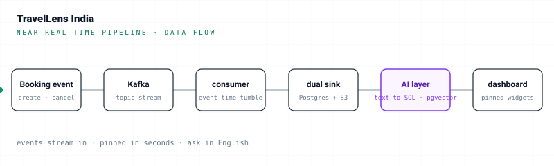

# TravelLens India


A real-time hotel and tourism intelligence platform for the Indian hospitality market — streaming pipeline, star-schema warehouse, local LLM serving layer, and a Grafana-style dashboard that turns plain-English questions into pinned, refreshable widgets.


> **Full architecture, design decisions, and trade-offs live in [`Travellens`](https://bh00t.github.io/travellens/) — the technical blueprint.** Open it in a browser for the deep dive. This README is the short front door.
>
> *Note: the blueprint is the **original** design (Flink streaming, DuckDB exploration, Claude API). The shipped build pivoted to a pure-Python Kafka consumer, dropped DuckDB, and serves a local Ollama model. Where the blueprint and the repo conflict, the repo wins.*

---

## The problem

Hospitality analytics in India still runs on overnight CSV exports and BI dashboards nobody can change without a developer. By the time the morning report lands, the window where you could have repriced an under-booked night, intercepted a churning loyalty guest, or flagged a sentiment swing has already closed. TravelLens collapses that loop: bookings stream in, results are queryable in seconds, and the people closest to the business compose their own widgets in plain English.

## Architecture at a glance

<picture>
  <source media="(prefers-color-scheme: dark)" srcset="./docs/assets/pipeline-flow-dark.svg">
  
</picture>

The principle: **the read path never triggers compute.** SQL is authored once by the LLM at pin time, frozen on the widget row, and re-executed against the warehouse on a schedule. Dashboard loads serve cached JSON — stale-while-revalidate, the same shape a CDN uses.

## Tech stack

| Layer       | Technology |
|-------------|------------|
| Streaming   | Kafka · Zookeeper · pure-Python event consumer · MinIO (S3) · Apache Parquet |
| Storage     | PostgreSQL 16 · pgvector |
| AI          | Ollama · Qwen2.5-Coder-7B (SQL) · sentence-transformers all-MiniLM-L6-v2 (embeddings) · IVFFlat |
| Serving     | Flask · Jinja2 · Chart.js |
| Dev / infra | Docker Compose · psql |

## Engineering highlights

For an honest per-feature reliability statement (where the system is trustworthy, where it isn't), see [`docs/capabilities-and-limits.md`](docs/capabilities-and-limits.md).

- **Streaming with idempotent dual sink.** 60-minute event-time tumbling windows keyed by city, dual-sunk to Postgres (UPSERT on `(city, window_start)`) and S3 Parquet (Hive-partitioned by year/month/day/hour). At-least-once delivery, idempotent end-to-end via the UPSERTs.
- **14-table star schema.** Two fact tables (bookings, price events), five dimensions, two pre-computed aggregates, four reference tables, plus `reviews_raw` carrying a 384-dim `embedding` column.
- **Text-to-SQL with a SELECT-only guard and self-correcting retry.** The LLM emits SQL; `sqlparse` rejects anything that isn't a `SELECT`; if Postgres errors at execution, the error string is fed back to the model for one retry before failing — see [`ai/text_to_sql.py`](ai/text_to_sql.py).
- **Semantic review search.** Reviews embedded once with `all-MiniLM-L6-v2` and queried via pgvector cosine distance under an IVFFlat index sized to the corpus (lists ≈ rows/1000, probes ≈ √lists), with a `DISTINCT ON (review_text)` layer to suppress the duplicate texts common in open review datasets.
- **Decoupled read / compute / author paths.** The LLM authors SQL only at pin time; refresh runs the frozen SQL with no LLM call; dashboard loads serve the JSONB result cache — so tab-switching back to the dashboard renders instantly instead of paying seconds of Ollama latency per widget.

## Data model

A classic Kimball star: facts at the center (`fact_bookings` ~1M rows, `fact_price_events` ~86k rows), surrounded by conformed dimensions (date, location, customer, hotel, room type), with hourly and daily pre-aggregates and a `reviews_raw` table holding the embedded text corpus (~133K rows). The blueprint walks through the join paths and the `dim_location.city`-is-authoritative rule that keeps city queries consistent across facts.

Per-table schemas, sample rows, design notes, and the full migration history live in the data-model reference — see the Documentation map below.

## Documentation map

One home per detail — this README is the front door; each doc below is the single source of its own subject. Start at `CLAUDE.md`, branch out as needed.

| Doc | What's in it / when to read |
|---|---|
| [`CLAUDE.md`](CLAUDE.md) | Repo index. Current phase status, hard rules, repo layout, frozen-file list, common mistakes, doc conventions. Read first; the rest of the navigation flows from here. |
| [`datamodel.md`](datamodel.md) | Data-model source of truth. Per-table schemas, sample rows, FK chains, the full migration history (003 → current), and the canonical regenerate sequence (Stage A base rebuild → Stage B B-046 dim expansion → Stage C lifecycle + review backfill). Anything LLM-facing that depends on a column existing is built from here or `information_schema`, never from memory. |
| [`db/schema.sql`](db/schema.sql) | The base 14-table star schema (frozen). The CURRENT schema is `schema.sql` PLUS every numbered file in [`db/migrations/`](db/migrations/); read both, not just one. |
| [`docs/phase-1-postgres.md`](docs/phase-1-postgres.md) · [`-2-streaming`](docs/phase-2-streaming.md) · [`-3-embeddings`](docs/phase-3-embeddings.md) · [`-4-ai-layer`](docs/phase-4-ai-layer.md) · [`-5-dashboard`](docs/phase-5-dashboard.md) · [`-6-airflow`](docs/phase-6-airflow.md) · [`-7-monitor`](docs/phase-7-monitor.md) | Per-phase build history + design notes. **History documents** — they record how each phase was originally built and how it evolved; current behaviour lives in CLAUDE.md / datamodel.md / backlog.md. Read them for the "why" behind a decision, not for the present state. |
| [`docs/backlog.md`](docs/backlog.md) | Work items (`B-NNN`) and known limitations (`L-NNN`) — open, in-progress, and a chronological Completed table with trace tags linking each item back to the phase doc, datamodel section, and data-gen scripts it touched. The status-of-record for every planned or shipped change. |
| [`docs/capabilities-and-limits.md`](docs/capabilities-and-limits.md) | What the AI layer does and the honest per-feature reliability statement: which query paths are trustworthy, which are best-effort, and the open caveats (L-numbers). Read before relying on a feature. |
| [Travellens blueprint](https://bh00t.github.io/travellens/) | Original technical design (Flink streaming, DuckDB exploration, Claude API). Useful for the "why" of the architecture; where the blueprint and the repo conflict, the repo wins. |

## Quickstart

Requires Docker, Python 3.11, and a local Ollama daemon.

```bash
# 1. Bring up Postgres + Kafka + Zookeeper + MinIO
cd docker
docker compose --env-file ../.env up -d

# 2. Apply schema and migrations in order
docker exec -i travellens-postgres psql -U travellens -d travellens < ../db/schema.sql
for f in $(ls ../db/migrations/*.sql | sort); do
  docker exec -i travellens-postgres psql -U travellens -d travellens < "$f"
done

# 3. Load the source CSVs into Postgres, then embed the reviews
python -m scripts.load_to_postgres
python -m scripts.generate_embeddings

# 4. Pull the local LLM and start the dashboard
ollama pull qwen2.5-coder:7b
python -m render.server
# → http://localhost:5000
```

The streaming pipeline runs separately; see [`docs/phase-2-streaming.md`](docs/phase-2-streaming.md) for producer and consumer commands.

### Running the stack — `run.py` reference

Once the one-time setup above is done, [`run.py`](run.py) is the dev launcher: one command, clean Ctrl-C teardown, and a startup *takeover* (newest-wins) that kills the prior supervisor + all six managed children and waits for the producer / gold / embedder / quarantine-rollup advisory locks to clear before binding singleton port 47219 — so re-launching after a crash never needs manual cleanup.

`python run.py` with no flags brings up Docker (if not already up), then six host processes: consumer · forward-generator simulator · Flask dashboard · gold lifecycle updater · review embedder · quarantine hourly rollup.

#### Common shapes

```bash
python run.py                              # full stack, default rate, no chaos
python run.py --rate-multiplier 3          # 3× the diurnal rate curve AND the daily cap
python run.py --chaos                      # 5% malformed + 2% late injection (seed 42)
python run.py --no-sim                     # consumer + dashboard live; you drive the producer yourself
python run.py --server-only                # ONLY the Flask dashboard (assumes stack already up)
python run.py --window 2                   # consumer runs with a 2-min window for fast monitor testing
python run.py --down                       # tear the Docker stack down and exit
```

#### Flags

| Flag | Effect |
|---|---|
| (none) | Full stack: Docker (if needed) + all 6 host processes at 1× rate, chaos off. |
| `--rate-multiplier N` | Integer >1 scales the forward generator's diurnal rate curve *and* daily cap uniformly (peak ≈ 20×N evt/s @ 19 IST; `daily_cap = 1,000,000 × N`, last-write-wins same-IST-day). Any invalid value is silently treated as 1. Folds in B-041 — the prior `--sim-rate` / `--rate` / `--duration` no-ops are gone. |
| `--chaos` | Simulator injects chaos (defaults: 5% malformed, 2% late, seed 42) — populates `/monitor`'s quarantine cards. Producer alone (no `run.py`) defaults to 1.2% / 0.8%. |
| `--malformed-pct PCT` · `--late-pct PCT` · `--chaos-seed N` | Per-knob overrides of the chaos defaults. Setting any of these implies `--chaos`. |
| `--no-sim` | Skip the simulator. Docker + consumer + dashboard + gold + embedder + quarantine-rollup still start; you send events yourself, e.g. `python -m scripts.kafka_event_producer --rate-multiplier 3`. |
| `--server-only` | Start ONLY the Flask dashboard. No consumer, no simulator, no Docker bring-up (assumes the stack/DB is already up). Beats `--no-sim` if both are passed. |
| `--no-docker` | Assume the Docker stack is already up; skip the `docker compose` step. |
| `--window MINUTES` | Override the consumer's tumbling-window size for this run only (e.g. `--window 2` flushes aggregates in ~2 min). Scoped to the consumer subprocess — never touches `.env` or shell, can't leak into a later run. Values below 5 also drop the watermark grace to 30s so a small window actually closes during the run. Production default is 60. |
| `--down` | Tear the Docker stack down and exit (no host processes started). |

#### Behaviour notes

- **Singleton.** `run.py` binds TCP port 47219 to enforce one supervisor at a time; a simultaneous second `python run.py` is rejected with "try again." Each long-running host child also holds its own Postgres advisory lock (producer 7400030 · gold 7400040 · embedder 7400050 · quarantine-rollup 7400060) so duplicate child instances cannot accumulate even across crashes.
- **Foreign-port guard.** If TCP `:5000` (Flask) is held by a non-TravelLens process, `run.py` reports the conflict and exits 1 — it never blind-kills unrelated processes.
- **Producer is wall-clock-only.** The forward generator emits at IST hour H with `event_ts = NOW(UTC)`; there is no sim-clock and `scripts/.sim_clock.json` is deleted on first launch (B-047 retired the calendar-replay model). Overdue lifecycle fire-times at startup drain at the bucket cap with `event_ts = NOW()` — never backdated.
- **Daily cap.** With `--rate-multiplier N`, today's `sim_daily_counter.cap` is upserted to `1,000,000 × N` (last-write-wins within the IST day); `events_emitted` accumulates across all sessions. On cap-hit the producer sleeps until IST midnight.

For the producer's wire-format details and the consumer's gate ordering, see [`docs/phase-2-streaming.md`](docs/phase-2-streaming.md).

## Design decisions and trade-offs

A short version of what the blueprint covers in depth:

- **Postgres now, Snowflake in production.** Postgres + pgvector is the right *demo* warehouse — everything in one process, vector index lives with the facts. Snowflake (or BigQuery) takes over once concurrency and storage outgrow single-node Postgres.
- **Local Ollama, not a hosted API.** Zero per-query cost, zero data egress, deterministic latency on a consumer GPU. The cost is model size: Qwen2.5-Coder-7B fits an RTX 3070, capping SQL quality versus a frontier model.
- **JSONB result cache now, Redis in production.** The `last_result_json` column on `dashboard_widgets` is a scoped-down stand-in with the same contract as Redis keyed by widget ID with a TTL equal to the refresh interval — the swap is one adapter away.
- **Frozen-SQL re-execution now, Airflow refresh DAG in production.** Refresh currently runs the frozen SQL on demand; the next step is an Airflow DAG running on each widget's interval and writing to the cache, so the read path stops touching Postgres entirely.
- **Synthetic booking stream now, Kafka Connect to a real PMS in production.** The producer is a Python simulator that mimics realistic PMS event patterns. The consumer's contract is the same against a real PMS connector — only the source changes.

---

For the full deep dive, open [`Travellens`](https://bh00t.github.io/travellens/) in a browser.
